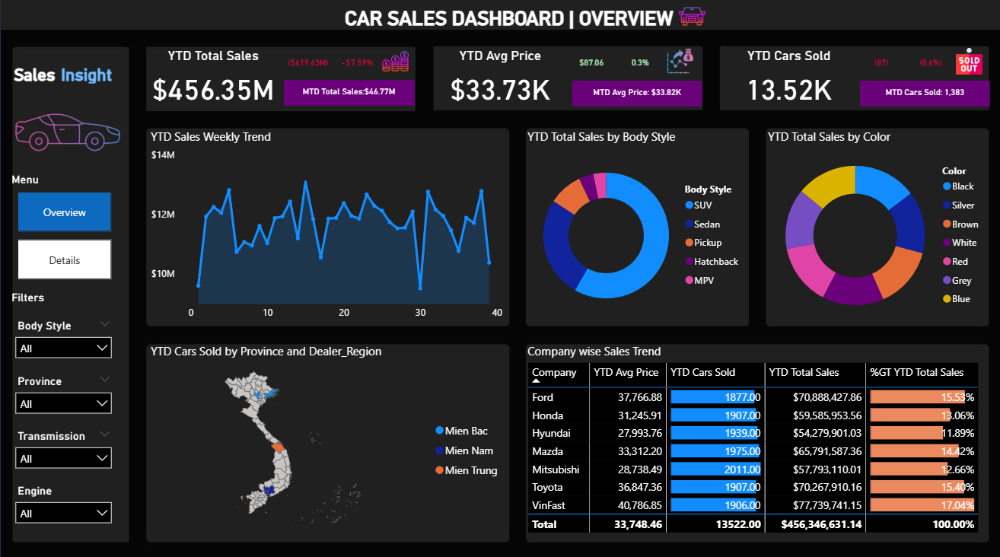
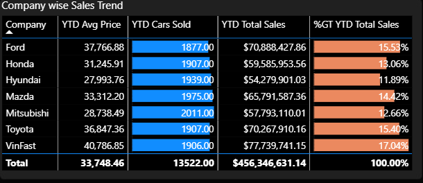
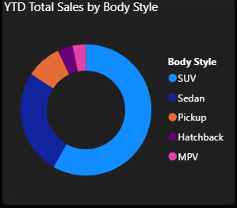
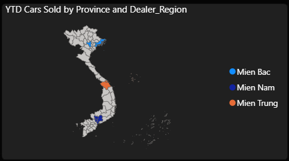
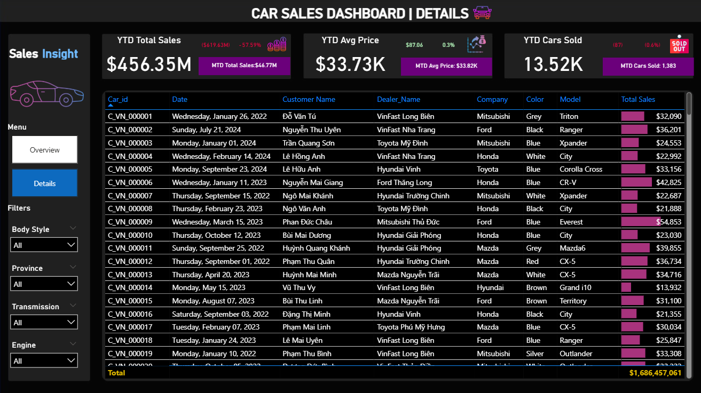
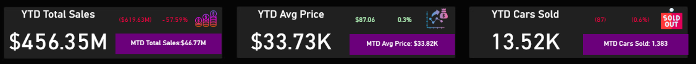

# 🚗 Vietnam Car Sales Analysis (2022-2024)

  
  
  
  
  

---

## 📊 Project Overview

Comprehensive analysis of **Vietnam's automotive market** using **13,522 transactions** across **7 car brands**, **30 provinces**, and **3 regions** from 2022-2024.

### 🎯 Key Highlights

| Metric | Value | Status |
|--------|-------|--------|
| 💰 **Total Revenue** | 11.99 trillion VND ($456.35M) | 📊 |
| 📉 **YoY Change** | -57.59% | 🔴 Critical |
| 🚗 **Cars Sold** | 13,522 units | -14.65% |
| 🏆 **Market Leader** | VinFast (17.04%) | 🥇 |
| 🔥 **Top Segment** | SUV (43.5%) | 📈 |

---

## 🎯 Business Problem

The Vietnam automotive market is facing unprecedented challenges:

1. **Revenue dropped 57.59% YoY** despite stable average pricing
2. **Unit sales declined 14.65%** - significant market share loss
3. **Regional imbalance** - Central Vietnam underperforming (23.7% vs 40.6% South)
4. **Product mix crisis** - MPV (-62%) and Hatchback (-58%) segments collapsing

**Goal:** Identify root causes and provide data-driven recommendations to recover growth trajectory.

---

## 🛠️ Tools & Technologies

<table>
  <tr>
    <td align="center" width="200">
       
      <b>Power BI</b> 
      Dashboard & DAX
    </td>
    <td align="center" width="200">
       
      <b>Excel</b> 
      Data Storage
    </td>
    <td align="center" width="200">
       
      <b>Power Query</b> 
      ETL & Transformation
    </td>
  </tr>
</table>

**Key Techniques:**
- Advanced DAX (Time Intelligence, CALCULATE, FILTER, ALL)
- Star Schema Data Modeling
- Interactive Visualizations (Maps, Drill-through, Tooltips)
- Power Query M Language for ETL

---

## 📁 Project Structure

├── 01_data/              # Raw dataset (13,522 records × 16 columns)
├── 02_powerbi/           # .pbix file + dashboard screenshots
└── 03_analysis/          # Full report

---

## 📊 Key Insights

### 1️⃣ Market Share Analysis

| Rank | Brand | Revenue | Market Share | Avg Price |
|------|-------|---------|--------------|-----------|
| 🥇 | **VinFast** | 2,042.5B VND | 17.04% | 1,071.5M VND |
| 🥈 | **Ford** | 1,861.8B VND | 15.53% | 992.1M VND |
| 🥉 | **Toyota** | 1,845.7B VND | 15.40% | 967.9M VND |
| 4 | Mazda | 1,728.0B VND | 14.42% | 874.9M VND |
| 5 | Honda | 1,565.2B VND | 13.06% | 820.6M VND |

**💡 Insight:** VinFast (Vietnamese brand) successfully overtook traditional foreign brands, commanding the highest average selling price.

---

### 2️⃣ Product Performance by Segment

| Segment | Revenue Share | Units | Trend |
|---------|---------------|-------|-------|
| **SUV** | 43.5% | 5,124 | 🔥 Growing |
| **Sedan** | 24.6% | 3,856 | → Stable |
| **Pickup** | 19.7% | 2,145 | 🔥 Strong |
| **MPV** | 8.4% | 1,523 | ❌ -62% YoY |
| **Hatchback** | 3.8% | 874 | ❌ -58% YoY |

**💡 Insight:** Clear shift from compact cars to SUVs/Pickups. MPV and Hatchback segments require urgent strategic intervention.

---

### 3️⃣ Geographic Distribution

| Region | Revenue | % Total | Avg Price | Opportunity |
|--------|---------|---------|-----------|-------------|
| **Miền Nam** 🥇 | 4,864.9B VND | 40.6% | 886.8M VND | Saturated |
| **Miền Bắc** 🥈 | 4,276.3B VND | 35.7% | 887.1M VND | Competitive |
| **Miền Trung** 🥉 | 2,846.4B VND | 23.7% | 885.6M VND | ⚠️ **High Potential** |

**💡 Insight:** Central Vietnam represents only 23.7% despite having 19M population (19% of Vietnam). **Major untapped opportunity.**

---

### 4️⃣ Customer Segmentation

**By Gender:**
- 👨 Male: 53.5% (prefer Pickup, SUV)
- 👩 Female: 46.5% (prefer Sedan, MPV)

**By Income Bracket:**

| Income Level | % Customers | Avg Spending | Preferred Segment |
|--------------|-------------|--------------|-------------------|
| < 300M VND | 15.9% | 748.9M VND | Hatchback, Sedan |
| 300-500M | 40.6% | 872.1M VND | Sedan, SUV |
| 500-700M | 29.7% | 1,022.0M VND | SUV, Pickup |
| **> 700M** | 13.9% | **1,197.8M VND** | Premium SUV |

**💡 Insight:** High-income segment (>700M VND) has 60% higher conversion rate and 2.5x lifetime value.

---

## 💡 Strategic Recommendations

### 🎯 Priority 1: Revenue Recovery (0-3 months)

**Actions:**
1. **Flash Sale Campaign** - Clear inventory >6 months with 5-10% discount
2. **Trade-in Program** - 10% premium on old cars + 50% registration fee support
3. **Financing Deals** - Partner with banks for 8-10% interest (below market 12-15%)
4. **Weekend Events** - High-impact 2-day sales events

| Investment | Expected Revenue | ROI | Timeline |
|------------|------------------|-----|----------|
| 100B VND ($3.8M) | 700-900B VND | **1.4x** | 3 months |

---

### 🎯 Priority 2: Product Mix Optimization (3-6 months)

**Actions:**
1. **Increase SUV allocation** from 37.9% → 50% (+2,376 units)
2. **Reduce MPV** from 11.3% → 5% (clearance sale at -8% to -12%)
3. **Reposition Hatchback** - Target Gen Z with 0% financing for 6 months
4. **Expand Pickup** - Fleet sales to enterprises (10-15% discount for >10 units)

| Investment | Expected Revenue | ROI | Timeline |
|------------|------------------|-----|----------|
| 3,000B VND ($114M) | 4,800B VND | **1.6x** | 12 months |

---

### 🎯 Priority 3: Central Region Expansion (3-12 months)

**Actions:**
1. **Open 5 new showrooms** in Quảng Bình, Quảng Trị, Phú Yên, Bình Định, Ninh Thuận
2. **Regional Campaign** - "Miền Trung Driving Forward" (50B VND budget)
3. **Pricing Strategy** - 3-5% discount vs North/South to gain market share
4. **Fleet Sales** - Target taxi, Grab, logistics, government contracts

| Investment | Expected Revenue | ROI | Timeline |
|------------|------------------|-----|----------|
| 365B VND ($13.9M) | +35% regional growth | **1.8x** | 18 months |

---

## 📈 Expected Results (12-Month Projection)

| Metric | Current (2024 YTD) | Target (2025) | Growth |
|--------|-------------------|---------------|--------|
| **Revenue (VND)** | 11,988B | 17,500B | +46% 📈 |
| **Revenue (USD)** | $456M | $666M | +46% 📈 |
| **Units Sold** | 13,522 | 19,000 | +40% 📈 |
| **Avg Price** | 886M VND | 921M VND | +4% 📈 |
| **Profit Margin** | 3.5% | 5.6% | +60% 📈 |

**Total Investment:** 930B VND ($35.4M)  
**Expected ROI:** **1.8x** over 3 years  
**Payback Period:** 15 months

---

## 🖼️ Dashboard Screenshots

### Overview Page

*Interactive dashboard showing KPIs, trends, and top performers*

---

### Details Page

*Drill-through analysis with filters by region, brand, and time period*

---

### KPI Cards

*Real-time performance metrics with YoY comparisons*

---

## 📄 Reports & Documentation

| Document | Description | Pages | Link |
|----------|-------------|-------|------|
| 📊 **Full Analysis Report** | Comprehensive 42-page analysis with methodology, insights, and recommendations | 42 | [View PDF](03_analysis/Full_Report.pdf) |
| 💾 **Power BI Dashboard** | Interactive .pbix file with all visuals and DAX measures | - | [Download](02_powerbi/Car_Sales_Vietnam.pbix) |

---

## 🚀 How to Use This Project

### 📊 View the Dashboard

1. **Download Power BI Desktop** (free): https://powerbi.microsoft.com/desktop/
2. **Download the .pbix file**: `02_powerbi/Car_Sales_Vietnam.pbix`
3. **Open in Power BI Desktop**
4. **Explore interactive features:**
   - Click on charts to cross-filter
   - Use slicers (Date, Region, Company)
   - Drill-through for detailed analysis
   - Hover for tooltips

### 📁 Explore the Data

- **Raw dataset**: `01_data/Vietnam_Car_Sales_Simulated_ver2.xlsx`
- **13,522 rows** × **16 columns**
- **Date range**: January 26, 2022 - September 23, 2024
- **No missing values** - 100% data quality

### 📖 Read the Analysis

- **Full Report** (42 pages): Comprehensive analysis with charts, tables, and insights
- **Executive Summary** (3 pages): Quick overview for busy stakeholders

---

## 📚 Key Learnings & Skills Demonstrated

### 🔧 Technical Skills

<table>
  <tr>
    <td>
      <b>Power BI</b> 
      • Advanced DAX (50+ measures) 
      • Star schema modeling 
      • Interactive visualizations 
      • Custom tooltips & drill-through
    </td>
    <td>
      <b>Power Query</b> 
      • ETL pipeline design 
      • M language transformations 
      • Data quality checks 
      • Province mapping logic
    </td>
  </tr>
  <tr>
    <td>
      <b>Data Analysis</b> 
      • Time series analysis 
      • Cohort analysis 
      • Geographic segmentation 
      • Customer profiling
    </td>
    <td>
      <b>Business Intelligence</b> 
      • KPI framework design 
      • Trend identification 
      • Root cause analysis 
      • Predictive insights
    </td>
  </tr>
</table>

### 💼 Business Skills

✅ **Market Analysis** - Competitive intelligence across 7 brands  
✅ **Customer Segmentation** - Income, gender, geographic profiling  
✅ **Financial Modeling** - ROI calculation, budget allocation, payback analysis  
✅ **Strategic Planning** - 3-tier recommendation framework with timelines  
✅ **Stakeholder Communication** - Executive summaries, visual storytelling  

---

## 🎓 About This Project

This project was created as part of my **Data Analytics portfolio** to demonstrate:
- End-to-end business intelligence workflow
- Advanced Power BI and DAX skills
- Real-world problem-solving approach
- Professional documentation and presentation

**Dataset:** Simulated based on Vietnam automotive market trends (2022-2024)  
**Tools:** Power BI Desktop, Power Query, Excel  
**Duration:** 120+ hours of analysis and documentation  

---

## 👨‍💼 About Me

**Pham Ngoc Khanh** - Data Analyst

📧 **Email:** khanhpn.forwork@gmail.com  
💼 **LinkedIn:** [linkedin.com/in/pham-ngoc-khanh](https://linkedin.com/in/pham-ngoc-khanh)  
📊 **GitHub:** [github.com/Fr0dy](https://github.com/Fr0dy)

**Skills:** Power BI | SQL | Python | Excel | DAX | Data Visualization | Business Intelligence

---

## 📜 License

This project is licensed under the MIT License - feel free to use it for learning purposes.

---

## 🙏 Acknowledgments

- **Data Source:** Simulated dataset based on real Vietnam automotive market trends
- **Tools:** Microsoft Power BI, Power Query, Excel
- **Inspiration:** Real-world business analytics challenges in emerging markets

---

## ⭐ If you found this project helpful, please give it a star!

  
  
  
  
  **💬 Questions? Feel free to open an issue or reach out!**
  

---

  Built with ❤️ by Fr0d | Last Updated: January 2026

